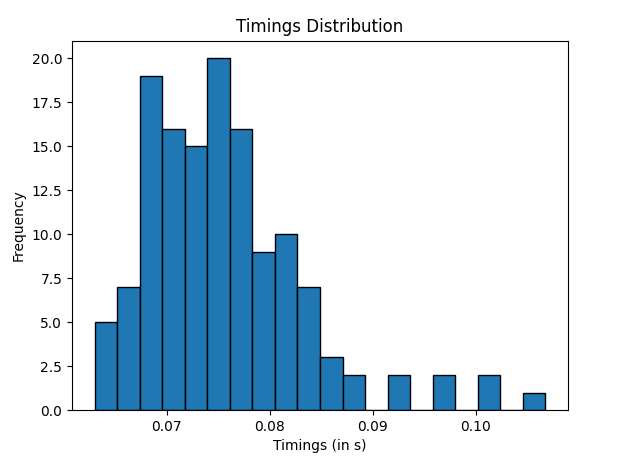

# TCP duration

I successfully developed an eBPF program to inject into the Linux TC (Traffic Control) system, enabling me to trace TCP connections and measure how much they last, from the client sending SYN packet to the server sending FIN packet. The primary goal of this eBPF program was to monitor and gather valuable data from TCP sessions on the network. The eBPF program was attached to the TC ingress hook and the engress.

## Workflow

### C-side

Since each TCP connection is identified by the source IP address, the destination IP address, the source port and the destination port, I created ```struct key_t```

```c
struct key_t {
    unsigned int  src_ip; 
    unsigned int  src_port;
    unsigned int  dst_ip; 
    unsigned int  dst_port;
};
```

I used a BPF_HASH map, whose keys are instances of the previous C-struct, while the values are expressed by yet another C-struct called ```struct value_t```. However, the Data Plane only transfers to the Control Plane the TCP connection coordinates and the difference in nano-seconds between SYN packet and FYN packet.

```c
struct value_t {
    unsigned long SYN_timestamp;
    unsigned long FIN_timestamp;
};
BPF_HASH(connections, struct key_t, struct value_t, MAX_SIZE);

BPF_PERF_OUTPUT(output);
struct data_t {
    unsigned int  src_ip; 
    unsigned int  src_port;
    unsigned int  dst_ip; 
    unsigned int  dst_port;
    unsigned long duration_ns;
};
```
-----
### Python-side

The Control Plane listens at any event for a given amount of time before exiting

```python
print(f"Writing on statistics.dat for {duration} seconds...")
# Get the current time in seconds
start_time = time()

while (time() - start_time) < duration:
    try:
        bpf_prog.perf_buffer_poll()
    except KeyboardInterrupt:
        break
```

-----
### Demo

```shell
$ cat statistics.dat

...
192.168.143.246:60634 -> 188.184.100.182:80    | Duration: 82038937
192.168.143.246:60636 -> 188.184.100.182:80    | Duration: 76524672
192.168.143.246:60638 -> 188.184.100.182:80    | Duration: 84152228
192.168.143.246:60640 -> 188.184.100.182:80    | Duration: 72229949
192.168.143.246:60642 -> 188.184.100.182:80    | Duration: 72942887
192.168.143.246:60648 -> 188.184.100.182:80    | Duration: 74185206
192.168.143.246:60664 -> 188.184.100.182:80    | Duration: 76232049
192.168.143.246:60666 -> 188.184.100.182:80    | Duration: 80710703
192.168.143.246:60672 -> 188.184.100.182:80    | Duration: 79343380
192.168.143.246:60678 -> 188.184.100.182:80    | Duration: 70982633
192.168.143.246:60684 -> 188.184.100.182:80    | Duration: 70589822
...
```

Hist diagram result



-----